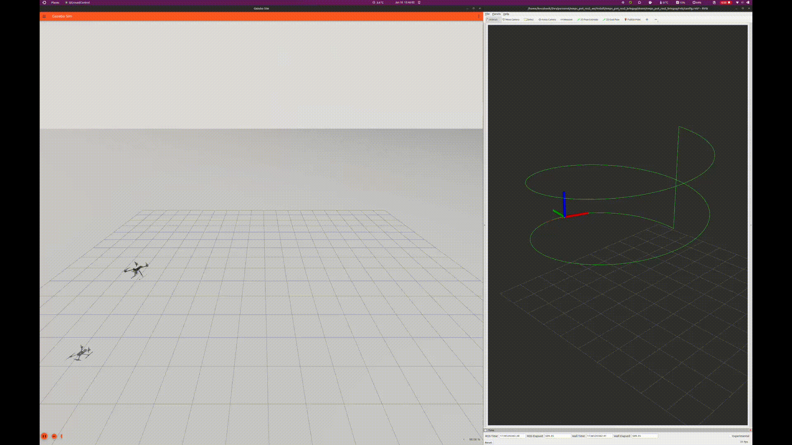

# NMPC PX4 ROS2 Trajectory Tracking Controller


[](https://docs.ros.org/en/humble/index.html)
[](https://github.com/PX4/PX4-Autopilot)
[](https://github.com/acados/acados)

This ROS2 package implements a nonlinear model predictive control (NMPC) pipeline for trajectory tracking of aerial vehicles running PX4 Autopilot. It uses ACADOS to define and solve the optimal control problem (OCP).

The OCP is set up in Python and ACADOS generates C code for the solver, which is used in a ROS2 C++ node to compute optimal control inputs based on the drone’s current state and reference trajectory. The package uses the PX4 ROS2 Interface library developed by [Auterion](https://github.com/Auterion/px4-ros2-interface-lib), which simplifies communication with PX4 and eliminates the need to directly handle uORB topics. This abstraction allows for better integration with PX4’s failsafe checks.

> [!WARNING]
> This package is experimental and intended for research and development purposes only. Users are advised to use this package at their own risk. Ensure thorough testing in a controlled environment before deploying on hardware.



## Features
1. **System Dynamics and Solver Setup**  
   - Utility script to define system dynamics, constraints, and solver options for NMPC.  
   - Automatically generates C code for the solver using ACADOS.  

2. **Trajectory Generation**  
   - Utility script to generate common trajectories (circles, helix, figure-eight, etc).  

3. **Trajectory Tracking Node**  
   - ROS 2 node that utilizes the generated C solver to control the drone through direct actuator inputs through the PX4 ROS2 Interface Library.  

4. **Odometry Republisher Node**  
   - Converts PX4's odometry (provided as a uORB topic) to a standard ROS 2 odometry message for visualization in Rviz.  

5. **External State Estimation Integration**  
   - Node to subscribe to external state estimation topics (motion capture system, visual inertial odometry, lidar inertial odometry, etc)
   - Fuses external state estimation with PX4's state estimation using the navigation interface of the PX4 ROS 2 Interface Library.  

6. **Utility Library**  
   - Functions to convert between NED (North-East-Down) and ENU (East-North-Up) coordinate systems.  
   - Functions to transform between forward-right-down (FRD) and forward-left-up (FLU) body frames.  

## Requirements
This package has been tested with ROS2 Humble on Ubuntu 22.04. Ensure your system meets the following requirements:  
  
1. **ROS2 Humble:** [https://docs.ros.org/en/humble/Installation/Ubuntu-Install-Debs.html](https://docs.ros.org/en/humble/Installation/Ubuntu-Install-Debs.html)
2. **PX4 Autopilot Source:** [https://docs.px4.io/main/en/dev_setup/building_px4.html](https://docs.px4.io/main/en/dev_setup/building_px4.html)
3. **ROS2 PX4 Setup:** [https://docs.px4.io/main/en/ros2/user_guide.html](https://docs.px4.io/main/en/ros2/user_guide.html)
4. **ACADOS:** (*Note:* Installation instructions for ACADOS are provided below.
5. **QGroundControl Daily Build:** [https://docs.qgroundcontrol.com/master/en/qgc-dev-guide/getting_started/index.html](https://docs.qgroundcontrol.com/master/en/qgc-dev-guide/getting_started/index.html)
6. **Docker (Optiona):** [https://docs.docker.com/engine/install/ubuntu/](https://docs.docker.com/engine/install/ubuntu/)

> [!NOTE]
>    - In theory, you can skip installing PX4 source code if you only plan to perform hardware tests on a PX4-compatible board that is flashed with the latest released firmware (v1.15.2). However, it is highly discouraged to test directly on hardware without first conducting SITL tests.
>    - This issue [https://github.com/Auterion/px4-ros2-interface-lib/issues/17](https://github.com/Auterion/px4-ros2-interface-lib/issues/17) on the px4-ros2-interface-lib suggests that [QGC Daily Build](https://docs.qgroundcontrol.com/master/en/qgc-user-guide/releases/daily_builds.html) should work, but I and others have had issues with custom modes not showing up with QGC Daily Build. The solution for me was to compile QGroundControl from source using the [container method](https://docs.qgroundcontrol.com/master/en/qgc-dev-guide/getting_started/container.html).

## Install
To install this package you can follow two approaches, either through docker or directly on your system:

### Docker Approach
1. Clone package and the direct submodules
```bash
git clone https://github.com/kousheekc/nmpc_px4_ros2.git --recursive
cd nmpc_px4_ros2
```
2. Build docker image
```bash
docker build -t nmpc_px4_ros2 .
```
3. Launch a container
```bash
xhost +local:docker
docker run -it --rm \                               
    -e DISPLAY=$DISPLAY \
    -v /tmp/.X11-unix:/tmp/.X11-unix:rw \
    --env="QT_X11_NO_MITSHM=1" \
    --privileged \
    --network=host \
    --name=nmpc_px4_ros2 \
    nmpc_px4_ros2
```

### Direct Approach
1. Make a new ros2 workspace or navigate to your existing workspace
```bash
mkdir -p ~/nmpc_px4_ros2_ws/src
cd ~/nmpc_px4_ros2_ws/src
```
2. Clone package and submodules
> [!WARNING]
> The following commands will clone the submodules as well. If your workspace already contains the *px4_msgs* package or the *px4-ros2-interface-lib* this will cause conflicts. This will also clone ACADOS. Modify the [.gitmodules](https://github.com/kousheekc/nmpc_px4_ros2/blob/main/.gitmodules) file, to exclude packages you may already have.
```bash
git clone https://github.com/kousheekc/nmpc_px4_ros2.git --recursive
cd nmpc_px4_ros2
```
3. Install ACADOS and ACADOS python interface
```bash
cd 3rd_party/acados
mkdir -p build
cd build
cmake -DACADOS_WITH_QPOASES=ON ..
make install -j4
cd ..
virtualenv env --python=/usr/bin/python3
source env/bin/activate
pip install -e interfaces/acados_template
```

## Usage
To use this package follow the instructions below

1. (Optional) Define system dynamics, constraints, solver options and generate C code.
> [!NOTE]
> This step is optional since the model/solver are already defined for a standard X500 frame drone. This step needs to be one if you change the system parameters or you want to use a different model or different solver options.
```bash
cd ~/nmpc_px4_ros2_ws/src/nmpc_px4_ros2/nmpc_px4_ros2/scripts
python3 nmpc_flight_mode.py
```

2. Build ROS2 packages
```bash
cd ~/nmpc_px4_ros2_ws
colcon build
```

3. Launch PX4 Simulation
```bash
cd <PX4-Autopilot source directory>
make px4_sitl gz_x500
```
On a different terminal
```bash
MicroXRCEAgent udp4 -p 8888
```

4. Launch NMPC Flight Mode
```bash
source install/setup.bash
ros2 launch nmpc_px4_ros2_bringup bringup.launch.py
```

5. Open QGroundControl Daily Build - Arm the drone, takeoff, select **NMPC Flight Mode** from the list of available flight modes

## License
This project is licensed under the BSD 3-Clause License - see the [LICENSE](https://github.com/kousheekc/nmpc_px4_ros2/blob/main/LICENSE) file for details.

## Contact
Kousheek Chakraborty - kousheekc@gmail.com

Project Link: [https://github.com/kousheekc/nmpc_px4_ros2](https://github.com/kousheekc/nmpc_px4_ros2)

If you encounter any difficulties, feel free to reach out through the Issues section. If you find any bugs or have improvements to suggest, don't hesitate to make a pull request.
